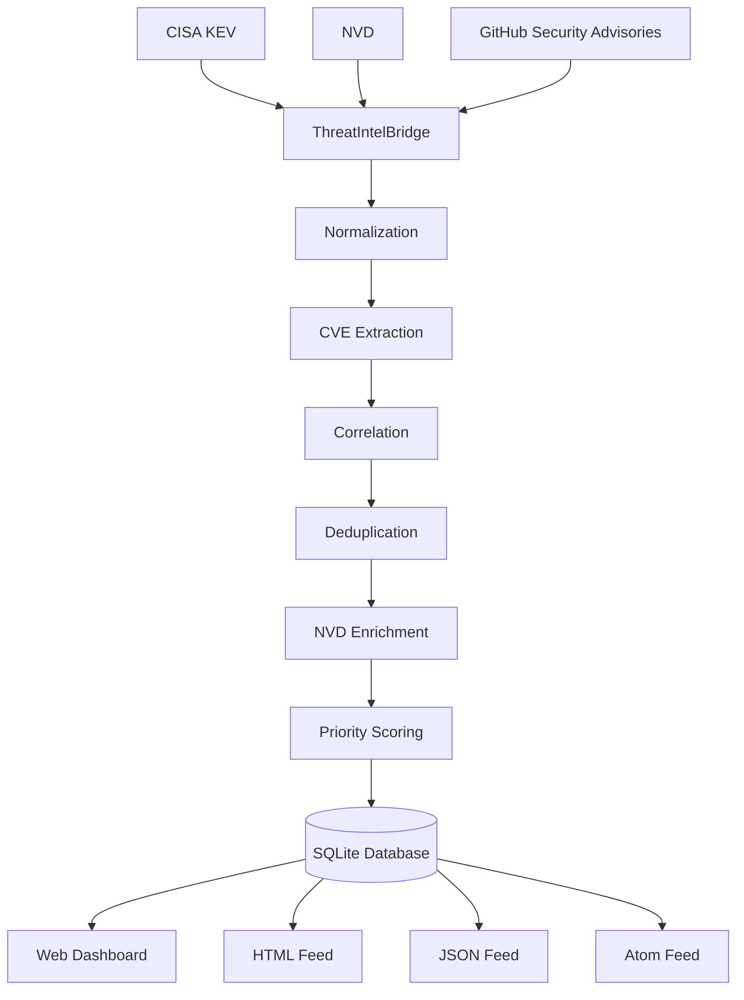
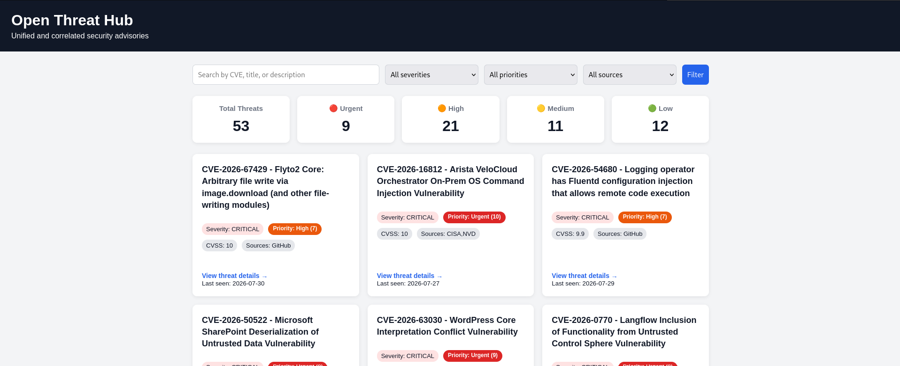
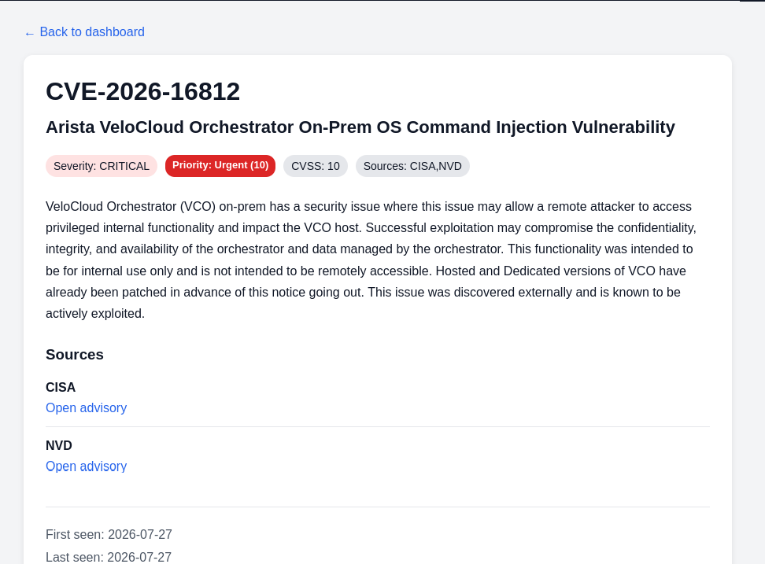

# Open Threat Hub

A self-hosted threat intelligence platform built on top of RSS-Bridge.

Open Threat Hub aggregates security advisories from trusted sources such as CISA KEV, NVD, and GitHub Security Advisories. It correlates vulnerabilities by CVE, removes duplicates, enhances results with NVD metadata, prioritizes threats, and presents everything through a unified dashboard and feed.

## Why Open Threat Hub

Security analysts often monitor multiple vulnerability sources every day. Switching between different platforms makes it difficult to identify the vulnerabilities that require immediate attention.

Open Threat Hub solves this by automatically collecting, correlating, enriching, prioritizing, and presenting threat intelligence in one place.

## Key Features

- Aggregate security advisories from multiple sources
- Correlate events using CVE IDs
- Remove duplicate entries
- Enrich vulnerabilities with NVD metadata
- Priority scoring system
- SQLite storage
- Search and filtering
- Unified web dashboard
- Multiple feed formats (HTML, JSON, and Atom)
- Automatic background updates using Docker

## Architecture

Open Threat Hub processes threat intelligence through a multi-stage pipeline that collects, normalizes, enriches, correlates, prioritizes, and stores vulnerability data before exposing it through the dashboard and feeds.



|||
|:-:|:-:|
|||

## Quick Start

Clone the repository:

```bash
git clone https://github.com/RENAZ18/ThreatIntelBridge.git
cd ThreatIntelBridge
```

Start the application:

```bash
docker compose up -d
```

The first startup may take a minute while Docker downloads the required images.

Once the application is running, Open Threat Hub automatically begins collecting threat intelligence from the configured sources.

Open your browser:

```
http://localhost:3000/dashboard.php
```

View the HTML feed [here](http://localhost:3000/?action=display&bridge=ThreatIntelBridge&format=Html).

## Data Sources

Open Threat Hub aggregates vulnerability information from multiple trusted security sources.

### CISA Known Exploited Vulnerabilities (KEV)

Provides vulnerabilities that have been confirmed as actively exploited in the wild.

### National Vulnerability Database (NVD)

Enriches vulnerabilities with official metadata, including descriptions, severity levels, and CVSS scores.

### GitHub Security Advisories

Provides security advisories published by the GitHub Advisory Database, including vulnerabilities affecting open source software.

## Priority Scoring

Open Threat Hub prioritizes vulnerabilities to help security analysts focus on the most important threats first.

The priority score is calculated using multiple factors, including:

- Threat source
- Severity
- CVSS score
- Vulnerability recency

Priority levels are classified as:

- 🔴 Urgent
- 🟠 High
- 🟡 Medium
- 🟢 Low

## Project Components

| Component | Purpose |
|----------|---------|
| ThreatIntelBridge | Main bridge that aggregates threat intelligence from multiple sources. |
| Services | Fetching, enrichment, CVE extraction, correlation, and priority scoring. |
| Database | SQLite persistence layer for threat events. |
| Dashboard | Web interface for viewing and filtering threats. |
| NVD Cache | Reduces repeated requests to the NVD API. |

## Built on top of RSS-Bridge

Open Threat Hub is built on top of the RSS-Bridge project.

RSS-Bridge provides the bridge framework used to fetch data from external sources, while Open Threat Hub extends it with threat intelligence capabilities such as:

- Multi-source aggregation
- CVE correlation
- Deduplication
- NVD enrichment
- Priority scoring
- SQLite persistence
- Unified dashboard

Open Threat Hub would not be possible without the excellent RSS-Bridge project and its extensible bridge framework.

## Contributing

Contributions are welcome!

If you would like to improve Open Threat Hub, please fork the repository, create a feature branch, and submit a pull request.

Please ensure that your changes are well documented and tested before submitting.
